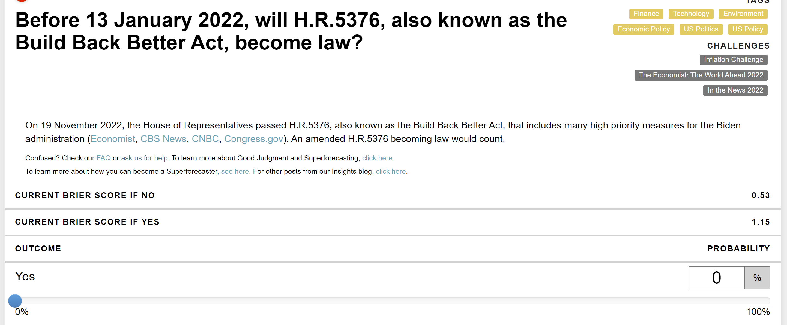

# gj-open-extension
Chrome Extension for GJOpen which calculates live brier score outcome

This is currently W.I.P and at the moment will only work for Yes/No questions.

When you add this extension, if you navigate to the 'My Forecasts' tab on an open yes/no question, two new rows will be inserted above the forecast slider, e.g.

